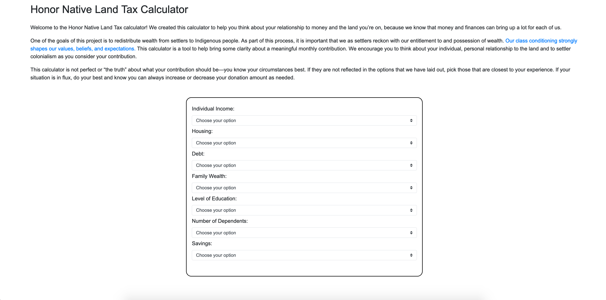
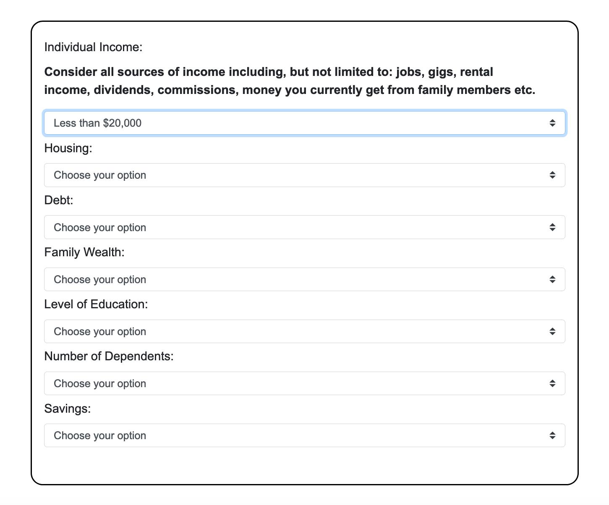
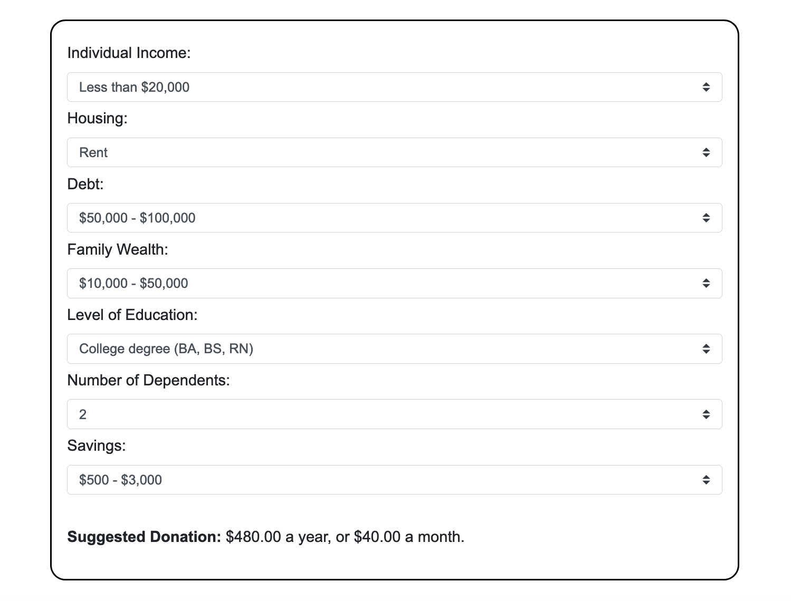

# Honor Native Land Tax Calculator

This project is a collaboration with [Albuquerque's Showing Up for Racial Justice (SURJ)](https://www.honornativelandtax.org/) group. 

## Scope:
Create a custom calculator that suggests a donation based on an indivdual's unique finnancial situation.

## Built With:
* HTML
* CSS
* JavaScript

## Screenshots:

## Demo:
* [Try it out here](https://natalie-poulson.github.io/hnlt-calculator/)
